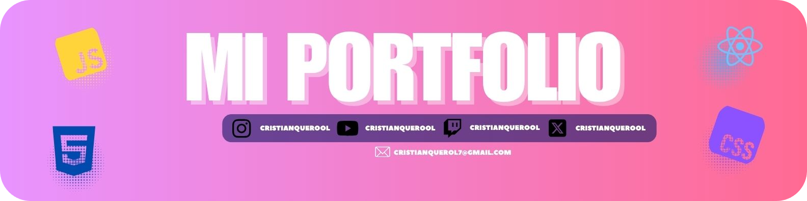

[](https://cristianquerolalves.com)


<div align="center">

[](https://formspree.io/) 
[](https://pages.github.com/) 
[](https://developer.mozilla.org/es/docs/Web/CSS) 
[](https://developer.mozilla.org/es/docs/Web/JavaScript) 
[](https://developer.mozilla.org/es/docs/Web/HTML) 
[](https://www.dafont.com/mona-sans.font)

</div>


---

## 📖 Descripción
Este es mi **portafolio interactivo**, diseñado para mostrar mis proyectos, habilidades y trabajos de manera profesional y moderna. Incluye un **estilo futurista Glassmorphism**, animaciones suaves y efectos visuales atractivos.

El portafolio cuenta con:

- Sección **Sobre mí** y disponibilidad para contratación.
- **Proyectos y trabajos** realizados.
- Tecnologías y herramientas que utilizo.
- **Formulario de contacto funcional** integrado con Formspree.
- Alternancia de **temas claro/oscuro** con persistencia.
- Sección de **clientes y logos interactivos**.

---

## 🛠 Tecnologías utilizadas
- **Frontend:** HTML5, CSS3 (Flexbox, Grid, Glassmorphism), JavaScript (Vanilla JS)  
- **Animaciones y efectos:** Intersection Observer, transformaciones CSS, transiciones suaves  
- **Formularios:** Integración con Formspree para enviar mensajes  
- **Temas:** Modo claro/oscuro con persistencia en LocalStorage  
- **Iconografía:** Ionicons  

---

## 🗂 Estructura del proyecto
```text
portfolio/
├─ index.html
├─ assets/
│   ├─ images/
│   ├─ fonts/
│   └─ icons/
├─ css/
│   └─ style.css
├─ js/
│   └─ main.js
└─ README.md
```

---

## 🚀 Cómo Usarlo

1. Clona el repositorio:
```bash
git clone https://github.com/cristianquerolalves1/portfolio.git
```

2. Abre `index.html` en cualquier navegador moderno para visualizarlo localmente.

3. Para desplegarlo en **GitHub Pages**:
   - Ve a la configuración del repositorio → Pages
   - Selecciona la rama `main` y la carpeta raíz `/`
   - Haz clic en `Save` y tu portafolio estará disponible online.

---

## 📬 Formulario de Contacto
El portafolio incluye un formulario de contacto funcional con **Formspree**:

1. Regístrate en [Formspree](https://formspree.io/) y crea un endpoint.
2. Reemplaza la URL en el atributo `action` del formulario:

```html
<form action="https://formspree.io/f/tu-endpoint" method="POST">
```

3. Asegúrate de que los campos tengan los atributos `name` correctos:

```html
<input type="text" name="name" required>
<input type="email" name="email" required>
<textarea name="message" required></textarea>
```

4. Cuando alguien envíe un formulario, recibirás los mensajes en el correo asociado a tu cuenta de **Formspree**.

---

## ⚖️ Licencia
Este portafolio es **propiedad personal** y **no es open-source**. Todos los derechos reservados a Cristian Querol Alves.

---

## 📬 Contáctame

Si quieres enviarme un mensaje, puedes usar el **formulario de contacto** integrado en mi portafolio. Está configurado con [Formspree](https://formspree.io/) para que los mensajes lleguen directamente a mi correo.

### Cómo usarlo:

1. Abre el portafolio en tu navegador.
2. Ve a la sección **Contacto**.
3. Completa los campos:
   - Nombre completo
   - Correo electrónico
   - Mensaje
4. Haz clic en **Enviar** y recibiré tu mensaje en mi correo asociado a Formspree.

> También puedes contactarme directamente a través de mis redes o correo electrónico:

<div align="center">

[](mailto:cristianquerol7@gmail.com)
[](https://www.instagram.com/cristianquerool)
[](https://discord.gg/HtJ8uMQBed)

</div>
